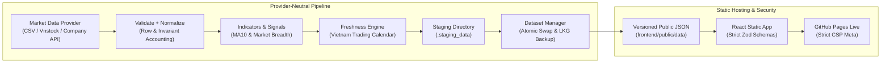

# 05 — Kiến trúc và triển khai

## 1. Kiến trúc tổng thể



GitHub Actions chạy pipeline và build; browser chỉ tải static assets/JSON. Không có secret, Python hay direct provider call trong browser.

---

## 2. Phân biệt các tầng kiến trúc

### A. Provider-Neutral Scaffolding
- Cung cấp giao diện chuẩn hóa `BaseMarketDataProvider` với `fetch_ohlcv(...) -> ProviderFetchResult` và `health_check() -> ProviderHealth`.
- Đảm bảo tính toán indicators (MA10, Volume 20D), market breadth và signal classification hoàn toàn độc lập với nhà cung cấp dữ liệu.
- Mặc định an toàn của dự án là **CSV fixture demo mode** với trạng thái phiên và freshness `UNKNOWN` (không giả mạo dữ liệu live).

### B. Configured Live Provider (Tùy chọn khi cấu hình)
- **`VnstockDataProvider`**: Adapter cho dữ liệu thị trường Việt Nam với rate-limiting, retry loop thực tế, containment timeout, và kiểm tra giá đóng cửa dương.
- **`CompanyApiDataProvider`**: Adapter cho API doanh nghiệp có xác thực. Tải endpoint và API key trực tiếp từ biến môi trường (`DATA_API_KEY`, `DATA_API_BASE_URL`).
- **Nguyên tắc bảo mật Zero Secret Leakage**: Tuyệt đối không đưa API token, bearer headers, raw payload, endpoint URL hoặc exception string vào log, parse warnings hoặc public JSON artifacts.

### C. Cơ chế Fail-Safe & Deployment Preservation trên GitHub Pages
- **Tính chất Ephemeral của GitHub Actions Runner**: Môi trường runner của GitHub Actions là tạm thời và được dọn dẹp sau mỗi run; thư mục `.lkg_data` cục bộ không tồn tại xuyên suốt giữa các workflow độc lập.
- **Production Fail-Safe Mặc định**: Khi pipeline fetch, validation hoặc security scanner phát hiện lỗi, workflow CI/CD sẽ dừng ngay lập tức (`exit 1`) và không tạo pages artifact. GitHub Pages tự động bảo lưu phiên bản triển khai thành công trước đó (Previous-Deployment Preservation).
- **Optional Persistent LKG**: Nếu cần lưu trữ Last-Known-Good bền vững qua các lần chạy định kỳ, có thể tích hợp với GitHub Actions Artifacts / Cache hoặc S3-compatible cold storage.

---

## 3. Cấu trúc repo

```text
.
├── docs/
│   ├── 01-overview-and-scope.md
│   ├── 02-methodology-and-indicators.md
│   ├── 03-system-rules-and-safety.md
│   ├── 04-data-contracts.md
│   ├── 05-architecture.md
│   └── AI_AUTONOMOUS_WORKFLOW.md
├── frontend/
│   ├── public/data/
│   ├── src/
│   │   ├── app/              # router, providers, app shell
│   │   ├── components/       # reusable UI components
│   │   ├── features/
│   │   │   ├── overview/
│   │   │   ├── screener/
│   │   │   └── symbol-detail/
│   │   ├── lib/              # fetch, format, URL/filter helpers
│   │   ├── schemas/          # strict runtime Zod validation
│   │   ├── styles/           # tokens + global CSS
│   │   └── test/
│   ├── package.json
│   └── vite.config.ts
├── pipeline/
│   ├── providers/
│   │   ├── base.py           # BaseMarketDataProvider ABC & Result types
│   │   ├── csv_provider.py   # Deterministic CSV fixture provider
│   │   ├── vnstock_provider.py # Vnstock rate-limited adapter
│   │   └── company_api_provider.py # Authenticated API adapter
│   ├── dataset_manager.py    # Staging & Last-Known-Good rollback manager
│   ├── freshness.py          # VN trading calendar & session status engine
│   ├── models.py             # Strongly-typed dataclasses & enums
│   ├── validation.py         # Row accounting & normalization
│   ├── indicators.py         # MA10 & Volume calculation
│   ├── signals.py            # Signal classification & market breadth
│   ├── serialization.py      # Atomically write & deep check JSON
│   └── build_dataset.py      # Master pipeline entrypoint
├── tests/
│   ├── fixtures/
│   ├── test_csv_provider.py
│   ├── test_dataset_manager.py
│   ├── test_freshness_engine.py
│   ├── test_indicators.py
│   ├── test_provider_interface.py
│   ├── test_security_check.py
│   ├── test_serialization.py
│   ├── test_signals.py
│   └── test_validation.py
├── scripts/
│   ├── build_all.py
│   └── security_check.py
├── .github/workflows/
│   ├── ci.yml
│   └── deploy-pages.yml
├── .env.example
├── .gitignore
├── AGENTS.md
├── DEVELOPER_LOG.md
└── README.md
```

---

## 4. Frontend Boundaries

### Data Layer
- `fetchJson(path, signal)` chịu trách nhiệm timeout/abort, HTTP status check và JSON parse.
- Strict runtime Zod schema validation ở boundary trước khi data vào application state.
- `manifest.json` tải trước; các file `overview.json`, `screener.json`, `symbols/*.json` tải theo route tương ứng.
- Request symbol detail được tự động abort khi người dùng chuyển mã hoặc unmount view.

### State & URL Sync
- Server/static data: custom hooks và in-memory cache.
- Filter, search query, sorting, pagination: URL hash query là Single Source of Truth.
- Responsive Views: Desktop Table và Mobile Cards hiển thị cùng một canonical dataset.

### Routing
- Sử dụng Hash Routing (`#/`, `#/screener`, `#/symbols/FPT`) để tương thích hoàn toàn với static hosting trên GitHub Pages.
- Mọi asset/data path đều sử dụng `import.meta.env.BASE_URL` (`/signal-tracker/`).

---

## 5. Pipeline Boundaries & Contract Invariants

### Provider Interface (`pipeline/providers/base.py`)
- `fetch_ohlcv(...) -> ProviderFetchResult`: trả về kết quả chuẩn hóa kèm đầy đủ hạch toán chất lượng:
  $$\text{input\_rows} = \text{accepted\_rows} + \text{rejected\_rows}$$
  kèm cờ `is_complete` và `provenance`.
- `fetch_records(...) -> List[OHLCVRecord]`: method tiện lợi trả về danh sách bản ghi đã được validate.
- `health_check() -> ProviderHealth`: kiểm tra khả năng kết nối non-destructive.
- **Trạng thái Adapters**: `VnstockDataProvider` và `CompanyApiDataProvider` hiện là các khung kết nối (architectural stubs) an toàn, trả về `is_healthy=False` khi chưa có cấu hình client/endpoint thực tế, tránh tạo ấn tượng sai lệch về nguồn cấp dữ liệu trực tiếp khi chưa có bản quyền hoặc tích hợp chính thức.

### Lịch giao dịch & Đánh giá Freshness (`pipeline/freshness.py`)
- **Phạm vi hỗ trợ**: 2025–2027 (phiên bản `2026.1-provisional`, nguồn: Định nghĩa lịch tạm thời dựa trên Quy chế giao dịch HOSE/HNX và các ngày nghỉ lễ theo Bộ luật Lao động Việt Nam; cần đồng bộ quy định hàng năm).
- **Nguyên tắc Fail-Closed**: Các ngày nằm ngoài phạm vi 2025–2027 đều được phân loại là không phải ngày giao dịch / trạng thái `UNKNOWN`.
- **Điều kiện `CLOSED_CONFIRMED` / `FRESH`**: Chỉ trả về `CLOSED_CONFIRMED` hoặc `FRESH` khi:
  1. Đang chạy với live market data provider (`is_live_provider=True`);
  2. Dữ liệu đã được xác nhận đầy đủ coverage theo universe và session (`is_complete=True`);
  3. Thời gian tham chiếu đã qua mốc 15:30 (kết thúc phiên khớp lệnh định kỳ đóng cửa và thanh toán bù trừ) của một ngày giao dịch hợp lệ.
- **Reference Time Injection**: Hỗ trợ truyền tham số `reference_time` để đảm bảo 100% tính lặp lại (reproducibility) trong kiểm thử và build cố định.

### Staging & Dataset Manager (`pipeline/dataset_manager.py`)
1. Tạo thư mục staging `.staging_data` sạch.
2. Kiểm tra sâu toàn bộ file JSON, schema, enum, bất biến toán học và cross-file consistency (`validate_data_directory`).
3. Kiểm tra ranh giới an toàn: thư mục staging, target, LKG và swap phải nằm hoàn toàn trong workspace (`realpath` + `normcase` + `commonpath`) và tách biệt nhau (disjoint).
4. Transactional rollback: Di chuyển an toàn staging $\rightarrow$ target. Nếu có lỗi xác thực sau khi chuyển hoặc trong quá trình cập nhật LKG, tự động rollback phục hồi byte-for-byte về phiên bản trước mà không để lại orphan directories.
5. Cập nhật bản sao `.lkg_data` để phục vụ khôi phục nhanh tại chỗ.

---

## 6. Security & Hardening Controls

- Tuyệt đối không đặt secret, credential, token hoặc private endpoints vào frontend code, `VITE_*` variables, git history hoặc public artifacts.
- Content Security Policy (CSP) nghiêm ngặt được cấu hình qua `<meta http-equiv="Content-Security-Policy">`:
  - `default-src 'self'`
  - `script-src 'self'`
  - `style-src 'self' 'sha256-3pRED1tOXas1FXFoPb9TGCjmYe9XQsmO9OV23khV2nY='`
  - `img-src 'self' data:`
  - `font-src 'self'`
  - `connect-src 'self'`
  - `object-src 'none'`
  - `base-uri 'self'`
  - `form-action 'self'`
