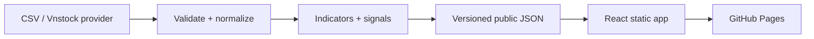

# 05 — Kiến trúc và triển khai

## 1. Kiến trúc tổng thể



GitHub Actions chạy pipeline và build; browser chỉ tải static assets/JSON. Không có secret, Python hay provider call trong browser.

## 2. Cấu trúc repo mục tiêu

```text
.
├── docs/
├── frontend/
│   ├── public/data/
│   ├── src/
│   │   ├── app/              # router, providers, app shell
│   │   ├── components/       # component dùng chung
│   │   ├── features/
│   │   │   ├── overview/
│   │   │   ├── screener/
│   │   │   └── symbol-detail/
│   │   ├── lib/              # fetch, format, URL/filter helpers
│   │   ├── schemas/          # runtime JSON validation
│   │   ├── styles/           # tokens + global CSS
│   │   └── test/
│   ├── package.json
│   └── vite.config.ts
├── pipeline/
│   ├── providers/
│   ├── models.py
│   ├── validation.py
│   ├── indicators.py
│   ├── signals.py
│   ├── serialization.py
│   └── build_dataset.py
├── tests/
│   ├── fixtures/
│   ├── test_validation.py
│   ├── test_indicators.py
│   ├── test_signals.py
│   └── test_serialization.py
├── scripts/
├── .github/workflows/
│   ├── ci.yml
│   └── deploy-pages.yml
├── .env.example
├── .gitignore
└── README.md
```

AI có thể đề xuất điều chỉnh nhỏ nhưng không được gom pipeline vào frontend hoặc tạo backend ngoài scope.

## 3. Frontend boundaries

### Data layer

- `fetchJson(path, signal)` chịu trách nhiệm timeout/abort, HTTP check và parse.
- Runtime schema validation ở boundary trước khi data vào app state.
- Manifest tải trước; các page data tải theo route.
- Request detail được abort khi user đổi symbol/unmount.
- Không retry vô hạn; tối đa một retry tự động cho lỗi mạng tạm thời, sau đó cho người dùng Retry.

### State

- Server/static data: query/cache layer nhỏ hoặc custom hooks; không cần global state library nếu React primitives đủ.
- Filter/sort/page: URL là source of truth.
- Preference không nhạy cảm: `localStorage` với key có version.
- Derived result dùng pure selector dùng chung cho table/card; không lưu bản sao dễ lệch.

### Routing và GitHub Pages

- Dùng hash routing: `/#/screener` và `/#/symbols/FPT`.
- Mọi asset/data path dùng `import.meta.env.BASE_URL` để chạy được ở project subpath.
- `vite.config.ts` nhận base từ cấu hình deploy công khai, không phải secret.
- Không phụ thuộc rewrite server.

### Performance

- Lazy-load route detail/chart nếu bundle benefit rõ.
- Không import toàn bộ icon library.
- Chỉ tải detail JSON khi mở mã.
- Screener vài nghìn row: paginate hoặc virtualize nếu đo thấy cần; ưu tiên semantic/accessibility trước.
- Chart resize theo container, không attach listener trùng.

## 4. Pipeline boundaries

### Provider interface

```python
class DataProvider(Protocol):
    def fetch_ohlcv(
        self,
        symbols: Sequence[str],
        start: date,
        end: date,
    ) -> DataFrame: ...
```

- Provider chỉ fetch/map field; không tính signal.
- Validation/normalization không biết vendor.
- Indicator và signal là pure/deterministic functions khi có thể.
- Serialization chỉ nhận model đã validate.

### Build flow

1. Parse cấu hình qua allow-list và validate.
2. Fetch vào vùng tạm.
3. Normalize + validate.
4. Tính indicator/signal/breadth.
5. Serialize vào staging directory.
6. Validate schema, cross-file consistency và public-data allow-list.
7. Atomic publish/copy sang `frontend/public/data`.
8. Build frontend.

Pipeline phải exit non-zero khi schema, secret scan hoặc invariant nghiêm trọng thất bại. Không deploy dataset lỗi chỉ để workflow xanh.

## 5. Configuration

### Public configuration

Có thể nằm trong repo:

- app title;
- GitHub Pages base path;
- provider name cho demo;
- universe public;
- freshness/display thresholds không nhạy cảm.

### Secret configuration

Chỉ ở GitHub Actions Secrets hoặc local environment không commit:

- API token/key;
- private endpoint credential;
- account/customer identifier;
- dữ liệu cấp phép không được public.

Không đặt secret dưới prefix `VITE_`. Theo tài liệu Vite, biến `VITE_*` được bundle và lộ cho client: [Vite Env Variables and Modes](https://vite.dev/guide/env-and-mode).

## 6. GitHub Actions

### CI workflow

- Trigger trên pull request và push.
- Mặc định `permissions: contents: read`.
- Không cung cấp data-provider secret cho workflow chạy code từ pull request không tin cậy.
- Chạy Python lint/type/test, frontend lint/type/test, schema validation, secret scan và production build.

### Deploy workflow

- Trigger manual và schedule sau giờ đóng cửa; schedule delay là tình huống bình thường.
- Có concurrency group để không deploy hai dataset chồng nhau.
- Job fetch chỉ nhận đúng secret cần thiết; secret không truyền sang frontend build nếu không cần.
- Job deploy có quyền tối thiểu theo GitHub Pages (`pages: write`, `id-token: write`, `contents: read`) và environment protection nếu repo hỗ trợ.
- Third-party actions pin full commit SHA; Dependabot/Renovate có thể mở PR cập nhật SHA.
- Upload đúng build artifact, không upload workspace, cache, `.git` hay raw input.

Tham chiếu: [GitHub Actions secure use](https://docs.github.com/en/actions/reference/security/secure-use) và [GitHub Pages HTTPS](https://docs.github.com/en/pages/getting-started-with-github-pages/securing-your-github-pages-site-with-https).

## 7. Dependency policy

- Commit lockfile của Python và npm theo công cụ đã chọn.
- CI dùng install deterministic (`npm ci` và equivalent Python lock install).
- Không thêm dependency cho helper nhỏ có thể viết/test rõ ràng.
- Dependency mới phải có: lý do, license phù hợp, maintenance status và security review cơ bản.
- Không load production JS từ CDN; bundle/self-host để lock version và giảm third-party risk.
- Bật dependency/security update của GitHub nếu có thể.

## 8. Observability không xâm phạm riêng tư

Phase 1 không cần analytics. Chất lượng build thể hiện qua:

- Actions summary: dataset id, counts, rejected rows, duration, artifact hash;
- log có cấu trúc, không chứa raw secret/credential;
- UI hiện `dataset_id`, app version, schema version và data-quality summary;
- lỗi client chỉ hiện local; không tự gửi sang dịch vụ bên thứ ba.

## 9. Local development contract

Repo cần cung cấp command ổn định (tên chính xác có thể được scaffold ở milestone 0):

```text
pipeline test
pipeline build --provider csv
frontend install
frontend dev
frontend test
frontend build
all checks
```

`CsvDataProvider` và fixture phải đủ để build/test offline, không bắt developer có secret chỉ để chạy website.
