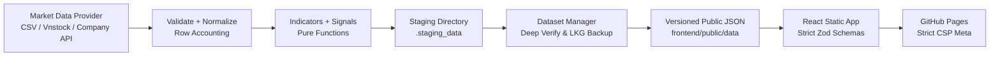

# 05 — Kiến trúc và triển khai

## 1. Kiến trúc tổng thể



GitHub Actions chạy pipeline và build; browser chỉ tải static assets/JSON. Không có secret, Python hay provider call trong browser.

## 2. Cấu trúc repo mục tiêu

```text
.
├── docs/
│   ├── 01-overview-and-scope.md
│   ├── 02-methodology-and-indicators.md
│   ├── 03-system-rules-and-safety.md
│   ├── 04-data-contracts.md
│   ├── 05-architecture.md
│   └── AI_AUTONOMOUS_WORKFLOW.md
├── frontend/
│   ├── public/data/
│   ├── src/
│   │   ├── app/              # router, providers, app shell
│   │   ├── components/       # reusable UI components
│   │   ├── features/
│   │   │   ├── overview/
│   │   │   ├── screener/
│   │   │   └── symbol-detail/
│   │   ├── lib/              # fetch, format, URL/filter helpers
│   │   ├── schemas/          # strict runtime Zod validation
│   │   ├── styles/           # tokens + global CSS
│   │   └── test/
│   ├── package.json
│   └── vite.config.ts
├── pipeline/
│   ├── providers/
│   │   ├── base.py           # BaseMarketDataProvider ABC & Result types
│   │   ├── csv_provider.py   # Deterministic CSV fixture provider
│   │   ├── vnstock_provider.py # Vnstock rate-limited adapter
│   │   └── company_api_provider.py # Authenticated API adapter
│   ├── dataset_manager.py    # Staging & Last-Known-Good rollback manager
│   ├── freshness.py          # VN trading calendar & session status engine
│   ├── models.py             # Strongly-typed dataclasses & enums
│   ├── validation.py         # Row accounting & normalization
│   ├── indicators.py         # MA10 & Volume calculation
│   ├── signals.py            # Signal classification & market breadth
│   ├── serialization.py      # Atomically write & deep check JSON
│   └── build_dataset.py      # Master pipeline entrypoint
├── tests/
│   ├── fixtures/
│   ├── test_csv_provider.py
│   ├── test_dataset_manager.py
│   ├── test_freshness_engine.py
│   ├── test_indicators.py
│   ├── test_provider_interface.py
│   ├── test_security_check.py
│   ├── test_serialization.py
│   ├── test_signals.py
│   └── test_validation.py
├── scripts/
│   ├── build_all.py
│   └── security_check.py
├── .github/workflows/
│   ├── ci.yml
│   └── deploy-pages.yml
├── .env.example
├── .gitignore
├── AGENTS.md
├── DEVELOPER_LOG.md
└── README.md
```

## 3. Frontend boundaries

### Data layer

- `fetchJson(path, signal)` chịu trách nhiệm timeout/abort, HTTP check và parse.
- Strict runtime Zod schema validation ở boundary trước khi data vào app state.
- Manifest tải trước; các page data tải theo route.
- Request detail được abort khi user đổi symbol/unmount.
- Không retry vô hạn; tối đa một retry tự động cho lỗi mạng tạm thời, sau đó cho người dùng nút Retry.

### State

- Server/static data: custom hooks và in-memory cache; không cần global state library cồng kềnh.
- Filter/sort/page: URL query hash là single source of truth.
- Responsive views: Desktop Table và Mobile Cards render cùng canonical data source.

### Routing và GitHub Pages

- Dùng hash routing: `/#/screener` và `/#/symbols/FPT`.
- Mọi asset/data path dùng `import.meta.env.BASE_URL` để chạy được ở project subpath.
- `vite.config.ts` nhận base từ cấu hình deploy công khai, không phải secret.

## 4. Pipeline boundaries & Provider Architecture

### Provider Interface (`pipeline/providers/base.py`)

```python
class BaseMarketDataProvider(ABC):
    @property
    @abstractmethod
    def provider_name(self) -> str: ...

    @abstractmethod
    def fetch_ohlcv(self, symbols=None, start_date=None, end_date=None) -> ProviderFetchResult: ...

    @abstractmethod
    def health_check(self) -> ProviderHealth: ...
```

- Provider chỉ fetch/map field và hạch toán số dòng (`input_rows`, `accepted_rows`, `rejected_rows`); không tự tính indicator hay signal.
- Validation/normalization không phụ thuộc vendor cụ thể.
- Indicator và signal là pure/deterministic functions.

### Freshness, Trading Calendar & Session Status (`pipeline/freshness.py`)

- `VietnamTradingCalendar`: kiểm tra ngày giao dịch thực tế trên thị trường chứng khoán Việt Nam (HOSE/HNX/UPCOM), loại trừ thứ Bảy, Chủ Nhật và các ngày nghỉ lễ theo quy định (Tết Nguyên Đán, Giỗ Tổ Hùng Vương 10/3 AL, 30/4–1/5, Quốc khánh 2/9, Tết Dương lịch 1/1).
- `evaluate_market_session_status`: Xác định trạng thái phiên giao dịch (`CLOSED_CONFIRMED` khi sau 15:30 của ngày giao dịch chuẩn có dữ liệu xác thực, `UNKNOWN` trong phiên hoặc ở chế độ dữ liệu mẫu demo).
- `evaluate_dataset_freshness`: Đánh giá `FRESH`, `STALE` hoặc `UNKNOWN`.

### Staging & Last-Known-Good Rollback Engine (`pipeline/dataset_manager.py`)

1. Build dataset vào thư mục staging tạm (`.staging_data`).
2. Deep validate schema, cross-file consistency và dataset_id.
3. Nếu hợp lệ: Atomic swap sang thư mục đích (`frontend/public/data`) và cập nhật bản sao Last-Known-Good (`.lkg_data`).
4. Nếu upstream fetch hoặc build thất bại: Tự động phục hồi từ bản sao Last-Known-Good gần nhất để đảm bảo GitHub Pages luôn có dữ liệu an toàn phục vụ người dùng.

## 5. Security & Configuration

- Tuyệt đối không đặt secret hoặc API token vào frontend code hoặc `VITE_*` environment variables.
- Tất cả secret (nếu có) được truyền qua GitHub Actions Secrets và chỉ truy cập trong backend pipeline step.
- Content Security Policy (CSP) nghiêm ngặt với `default-src 'none'`, `script-src 'self'`, `style-src 'self' '<sha256>'`, `connect-src 'self'`, `img-src 'self' data:`.
