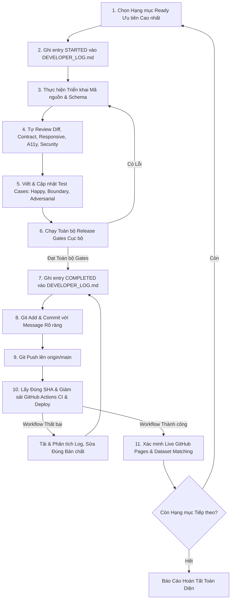

# Quy Trình Thực Thi Tự Trị Cho AI Coding Agent (AI Autonomous Workflow)

Tài liệu này là chuẩn mực quy trình vận hành thống nhất cho mọi AI/Coding Agent khi tiếp quản, phát triển, kiểm thử và phát hành mã nguồn trong repository **VN Stock Signal**.

Mọi hướng dẫn riêng biệt hoặc prompt giao việc cho agent đều phải tuân thủ và quy chiếu về tài liệu chuẩn này.

---

## 1. Nguyên Tắc Cốt Lõi

1. **Autonomous Execution (Tự Trị Liên Tục)**:
   - Agent không dừng lại sau khi lập kế hoạch, sau một commit hoặc sau một lần chạy test thành công đầu tiên.
   - Tự động lặp lại quy trình: sửa mã $\rightarrow$ chạy test $\rightarrow$ tự review diff $\rightarrow$ khắc phục mọi lỗi phát hiện $\rightarrow$ chạy toàn bộ release gates cho đến khi đạt chuẩn phát hành.
   - Chỉ chuyển giao lại cho người dùng khi:
     - Toàn bộ hạng mục trong phạm vi đã hoàn thành và xác minh live; hoặc
     - Gặp blocker thực sự cần credential bên ngoài, lựa chọn nhà cung cấp trả phí, license pháp lý hoặc quyết định sản phẩm từ người sở hữu repo (khi đó phải gom thành **một nhóm câu hỏi duy nhất**).

2. **Truthful Verification (Xác Thực Trung Thực Tuyệt Đối)**:
   - Tuyệt đối không tuyên bố "PASS", "All green" hoặc "hoàn thành" nếu chưa chạy lệnh thực tế trong môi trường.
   - Mọi số liệu thống kê test phải phân biệt chính xác theo từng module (ví dụ: số test của `test_security_check.py` vs. tổng Python suite).
   - Không sử dụng các tuyên bố tuyệt đối không thể kiểm chứng (ví dụ: "zero bypass vectors"). Mô tả chính xác các biên adversarial cases đã được kiểm thử.

3. **Fail-Closed & Safe Defaults**:
   - Mọi trường hợp lỗi schema, thiếu dữ liệu, sai lệch `dataset_id` hoặc lỗi mạng đều phải fail-closed: tự động ẩn/khóa tín hiệu tài chính và hiển thị thông báo an toàn rõ ràng.
   - Safe default luôn là chế độ `demo`/`fixture`/`UNKNOWN`, không bao giờ giả lập dữ liệu mẫu thành dữ liệu thị trường trực tiếp (`CLOSED_CONFIRMED` hay `FRESH`).

4. **Bảo Mật Tuyệt Đối (Zero Secret Leakage)**:
   - Tuyệt đối không đưa API key, token, credential vào frontend, commit Git, log file hoặc artifact GitHub Pages.
   - Không bao giờ nới lỏng Content Security Policy (CSP) hay tắt bỏ security checks để làm CI xanh.

---

## 2. Vòng Lặp Thực Thi Bắt Buộc (The Execution Loop)

Với mỗi hạng mục hoặc phase:

### Chi Tiết Từng Bước:

1. **Khởi động & Ghi nhận Log**:
   - Trước khi sửa bất kỳ file nào, append một entry `STARTED` vào `DEVELOPER_LOG.md` với Session ID duy nhất, ISO 8601 timestamp (kèm UTC offset), phạm vi, giả định và các file dự kiến thay đổi.
2. **Triển khai Đồng bộ**:
   - Cập nhật đồng thời: Data models $\rightarrow$ Pipeline serializers $\rightarrow$ Security scanner $\rightarrow$ Frontend Zod schemas $\rightarrow$ TypeScript components $\rightarrow$ Unit/Integration tests $\rightarrow$ Documentation.
3. **Tự Review Nghiêm Ngặt**:
   - Review `git diff` toàn diện: không để lọt debug log, file rác, biến môi trường nhạy cảm.
   - Đảm bảo responsive hoàn hảo ở tất cả các kích thước: $320\text{px}$, $390\text{px}$, $768\text{px}$, $1440\text{px}$.
   - Kiểm tra chuẩn Accessibility WCAG 2.1 AA (Axe clean, contrast ratio, keyboard navigation, focus trap).
4. **Kiểm Thử Toàn Diện**:
   - Bổ sung test cho: Happy path, Edge cases, Malformed data, Schema violations, Network failures, CSP violations, và Negative control tests.
5. **Chạy Toàn Bộ Release Gates Tối Thiểu**:
   - `python -m unittest discover tests -v`
   - `npm --prefix frontend test -- --run`
   - `npm --prefix frontend run typecheck`
   - `npm --prefix frontend run build:pages`
   - `python scripts/security_check.py --artifact frontend/dist`
   - `npm --prefix frontend run test:e2e`
   - `npm --prefix frontend audit --audit-level=high`
   - `python scripts/build_all.py`
   - `git diff --check`
6. **Hoàn Tất Entry Log**:
   - Ghi entry `COMPLETED` vào `DEVELOPER_LOG.md` trước khi commit, tổng hợp chính xác các thay đổi, quyết định và kết quả test thực tế.
7. **Commit & Push**:
   - Commit với semantic message chuẩn.
   - Push lên `origin/main`.
8. **Giám Sát Remote Workflows**:
   - Giám sát cả **CI** (`.github/workflows/ci.yml`) và **Deploy to GitHub Pages** (`.github/workflows/deploy-pages.yml`) của chính commit SHA vừa push cho đến khi `conclusion=success`.
9. **Xác Minh Thực Tế trên Live Production**:
   - Truy vấn live `manifest.json` và `overview.json`.
   - Đối chiếu `dataset_id` (16 ký tự hex) giữa bản local và bản live.
   - Chạy smoke tests trên live URL (`https://tdieney.github.io/signal-tracker/`) để xác nhận giao diện hoạt động bình thường, không có lỗi console, không có lỗi mạng hay tràn màn hình.

---

## 3. Quy Định Về File Cục Bộ và Diagnostic Artifacts

Tuyệt đối **KHÔNG** stage hoặc commit các file sau vào kho mã nguồn:
- `error.png`
- `logs_*.zip`
- `logs_*/`
- `frontend/dist/` (chỉ được tạo trong CI runner hoặc kiểm tra build cục bộ)
- `frontend/playwright-report/`, `frontend/test-results/`
- `.staging_data/`

---

## 4. Tiêu Chuẩn Phản Hồi Khi Hoàn Tất

Khi kết thúc toàn bộ nhiệm vụ hoặc khi gặp blocker hợp lệ, phản hồi cuối cùng phải ngắn gọn, súc tích và cung cấp đầy đủ bằng chứng kiểm chứng:
- Danh sách các hạng mục đã hoàn thành.
- Exact final commit SHA.
- Link trực tiếp tới CI workflow run và Deploy workflow run trên GitHub.
- Bảng kết quả từng release gate với số lượng test thực tế.
- Live URL và live `dataset_id`.
- Kết quả kiểm tra responsive, accessibility, security scan và live smoke test.
- Trạng thái `git status` sạch sẽ.
- Trích dẫn entry `DEVELOPER_LOG.md` tương ứng.
- Danh sách blocker hoặc quyết định cần người dùng phản hồi (nếu có).
